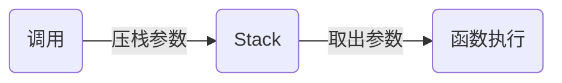

# 芯片：
第一次工业革命-蒸汽机，能源-煤炭
第二次工业革命-发电机，能源-电
第三次工业革命-计算机，能源-芯片（一种数字能量，本质是计算）
第四次工业革命-人工智能，能源-数据

数字能量产生：
电能供给给芯片，芯片中的一种电子元件晶振（也就是石英晶体）通电后产生震荡，震荡会产生频率稳定的脉冲信号。通常这是一种高频的脉冲信号，每秒可达百万次。然后，我们通过谐振效应发放这个信号，形成方波。再通过电子元件调整这种脉冲的频率，把脉冲信号转换为我们需要的频率，这就形成了驱动芯片工作的时钟信号。这种信号的频率，我们也称作芯片的时钟频率。最后，时钟信号驱动着芯片工作，就像人体的脉搏一样，每一次脉冲到来，都让芯片的状态发生一次变化，用这种方法，最终存储器中的指令被一行行执行。指令被执行，其实就是数据被计算，这就是计算能量。
# 图灵机和可计算理论
1936 年，被誉为人工智能之父的阿兰·图灵提出了图灵机，它是一种不断执行指令的抽象计算机。之所以说抽象，是因为图灵并没有真的造出这台机器，而是把它当成理论去和大家探讨可计算问题。
- 第一，它清楚地定义了计算机能力的边界，也就是可计算理论；
- 第二，它定义了计算机由哪些部分组成，程序又是如何执行的。

图灵通过数学证明了，一个问题如果可以拆解成图灵机的可执行步骤，那问题就是可计算的。另一方面，图灵机定义了计算机的组成以及工作原理，但是没有给出具体的实现。

图灵发现如果一个问题是可计算的，那么它的解决方案就必须可以被具化成一条条的指令，也就是可以使用图灵机处理。因此，不能使用图灵机处理的问题，都是不可计算的问题。

## 不可计算问题
eg:素数是不是有无穷多个
eg:停机问题（无法实现用一个通用程序去判断另一个程序是否会停止。比如你用运行这段程序来检查一个程序是否会停止时，你会发现不能因为这个程序执行了 1 天，就判定它不会停止，也不能因为这个程序执行了 10 年，从而得出它不会停止的结论。这个问题放到图灵机领域，叫作停机问题）
## 复杂度
在可计算问题中，有困难问题，也有简单问题，通常用复杂度来衡量：
- 求数组第 10 个元素”，计算这种问题，时间开销、空间开销都不会随着问题规模增长，我们记为 O(1)；
- “求数组中的最大值”，计算这种问题，时间开销会随着数组规模线性增大，记作 O(N)，N 是问题的规模；
- 还有像“求一个n*n矩阵的和”，如果n是规模，那么时间开销会随着问题规模的平方增长，我们称作 O(N2)；
- 当然也有更加复杂的数学模型，比如说O(N3)、O(N4)、O(N100)等。
## 冯诺依曼模型

计算机的组成以及工作原理由冯诺依曼和其他几位科学家提出，遵循了图灵机的设计并提出用电子元件构造计算机，约定了用二进制进行计算和存储，并且将计算机结构分成以下5个部分：
1. 输入设备；
2. 输出设备；
3. 内存：存储单位是一个二进制位，bit。最小的存储单位为字节，就是8位，英文byte，每个字节都对应一个内存地址。通常所说的内存都是随机存取器，就是读取任何一个地址数据的速度都是一样的，写入任何一个地址数据的速度也是一样的
4. 中央处理器：CPU，负责控制和计算，为了方便计算较大的数值，CPU每次可以计算多个字节的数据。
if CPU每次可以计算4byte，为32为CPU
if 可以计算8byte，为64位CPU
32和64称作位宽
为什么 CPU 要这样设计呢？ 因为一个 byte 最大的表示范围就是 0~255。比如要计算 20000*50，就超出了byte 最大的表示范围了。因此，CPU 需要支持多个 byte 一起计算。当然，CPU 位数越大，可以计算的数值就越大。但是在现实生活中不一定需要计算这么大的数值。比如说 32 位 CPU 能计算的最大整数是 4294967295，这已经非常大了。
5. 总线：用于CPU和内存以及其他设备之间的通信
# 程序的执行过程	
当 CPU 执行程序的时候：

1. 首先，CPU 读取 PC 指针指向的指令，将它导入指令寄存器。具体来说，完成读取指令这件事情有 3 个步骤：
**步骤 1**：CPU 的控制单元操作地址总线指定需要访问的内存地址（简单理解，就是把 PC 指针中的值拷贝到地址总线中）。
**步骤 2**：CPU 通知内存设备准备数据（内存设备准备好了，就通过数据总线将数据传送给 CPU）。 
**步骤 3**：CPU 收到内存传来的数据后，将这个数据存入指令寄存器。
完成以上 3 步，CPU 成功读取了 PC 指针指向指令，存入了指令寄存器。
2. 然后，CPU 分析指令寄存器中的指令，确定指令的类型和参数。
3. 如果是计算类型的指令，那么就交给逻辑运算单元计算；如果是存储类型的指令，那么由控制单元执行。
4. PC 指针自增，并准备获取下一条指令。
# 指令
* I/O 类型的指令，比如处理和内存间数据交换的指令 store/load 等；再比如将一个内存地址的数据转移到另一个内存地址的 mov 指令。

* 计算类型的指令，最多只能处理两个寄存器，比如加减乘除、位运算、比较大小等。

* 跳转类型的指令，用处就是修改 PC 指针。比如编程中大家经常会遇到需要条件判断+跳转的逻辑，比如 if-else，swtich-case、函数调用等。

* 信号类型的指令，比如发送中断的指令 trap。

* 闲置 CPU 的指令 nop，一般 CPU 都有这样一条指令，执行后 CPU 会空转一个周期。
# 64 位和 32 位比较有哪些优势
其实，这个问题需要分类讨论：
如果说的是 64 位宽 CPU，那么有 2 个优势：
* 优势 1：64 位 CPU 可以执行更大数字的运算，这个优势在普通应用上不明显，但是对于数值计算较多的应用就非常明显。
* 优势 2：64 位 CPU 可以寻址更大的内存空间

如果 32 位/64 位说的是程序，那么说的是指令是 64 位还是 32 位的。32 位指令在 64 位机器上执行，困难不大，可以兼容。 如果是 64 位指令，在 32 位机器上执行就困难了。因为 32 位指令在 64 位机器执行的时候，需要的是一套兼容机制；但是 64 位指令在 32 位机器上执行，32 位的寄存器都存不下指令的参数。

操作系统也是一种程序，如果是 64 位操作系统，也就是操作系统中程序的指令都是 64 位指令，因此不能安装在 32 位机器上。
# 条件控制程序
条件控制程序有两种典型代表，一种是 if-else ，另一种是 switch-case
它们的内部实现是不一样的。
if-else 是一个自上向下的执行逻辑， switch-case是一种精确匹配算法。比如你有 1000 个 case，如果用 if-else 你需要一个个比较，最坏情况下需要比较 999 次；而如果用 switch-case ，就不需要一个个比较，通过算法就可以直接定位到对应的case 
# 函数
函数的执行过程涉及一种叫做栈的数据结构
```
int add(int a, int b){
  return a + b;
}

```
1. 通过观察，我们发现函数的参数 a,b 本质是内存中的数据，因此需要给它们分配内存地址。
2. 函数返回值也是内存中的数据，也就是返回值也需要分配内存地址。
3. 调用函数其实就是跳转到函数体对应的指令所在的位置，因此函数名可以用一个标签，调用时，就用 jump 指令跟这个标签。
比如上面函数进行了a+b的运算，我们可以这样构造指令：
```
# 首先我们定义一个叫作add的标签
add:
# 然后我们将a和b所在地址中的数据都导入寄存器
load $a -> R0
load $b -> R1
# 然后我们将寄存器求和，并将结果回写到返回地址
add R0 R1 R2
store R2 -> $r
```
当我们需要调用这个函数的时候，我们就构造下面这样的指令：
```
jump add
```
那么参数如何传递给函数？返回值如何传递给调用者呢？

首先在调用方，我们将参数传递给栈；然后在函数执行过程中，我们从栈中取出参数。

函数执行过程中，先将执行结果写入栈中，然后在返回前把之前压入的参数出栈，调用方再从栈中取出执行结果。

将参数传递给 Stack 的过程，叫作压栈。取出结果的过程，叫作出栈。
因为栈中的每个数据大小都一样，所以在函数执行的过程中，我们可以通过参数的个数和参数的序号去计算参数在栈中的位置。

eg:假设计算11+15，首先在内存中开辟一块单独的空间，也就是栈。

栈的使用方法是不断往上堆数据，所以需要一个栈指针（Stack Pointer， SP）指向栈顶（也就是下一个可以写入的位置）。每次将数据写入栈时，就把数据写到栈指针指向的位置，然后将 SP 的值增加。

为了提高效率，我们通常会用一个特殊的寄存器来存储栈指针，这个寄存器就叫作 Stack Pointer，在大多数芯片中都有这个特殊的寄存器。一开始，SP 指向 0x100 位置，而 0x100 位置还没有数据。
**压栈11**
先将 11 压栈，之所以称作压栈（ Push)，就好像我们把数据 11 堆在内存中一样。模拟压栈的过程是下面两条指令：
```
store #11 -> $SP // 将11存入SP指向的地址0x100
add SP, 4, SP  // 栈指针增加4（32位机器）
```
第一条 store 指令将 SP 寄存器指向的内存地址设置为常数 11。

第二条指令将栈指针自增 4。

这里用美元符号代表将 11 存入的是 SP 寄存器指向的内存地址，这是一次间接寻址。存入后，栈指针不是自增 1 而是自增了 4，因为我在这里给你讲解时，用的是一个 32 位宽的 CPU 。如果是 64 位宽的 CPU，那么栈指针就需要自增 8。

压栈完成后，内存变成下图中所示的样子。11 被写入内存，并且栈指针指向了 0x104 位置。

**压栈15**

压栈后，11 和 15 都被放入了对应的内存位置，并且栈指针指向了 0x108。
**将返回值压栈**
接下来，我们将返回值压栈。到这里你可能会问，返回值还没有计算呢，怎么就压栈了？其实这相当于一个占位，后面我们会改写这个地址。

**调用函数**
```
jump add
```
这个时候，要加和在栈中的数据 11 和 15，我们可以利用 SP 指针寻找数据。11 距离当前 SP 指针差 3 个位置，15 距离 SP 指针差 2 个位置。这种寻址方式是一种复合的寻址方式，是间接 + 偏移量寻址。

我们可以用下面的代码完成将 11 和 15 导入寄存器的过程：
```
load $(SP - 12) -> R0
load $(SP - 8) -> R1
```
然后进行加和，将结果存入 R2。
```
load R0 R1 R2
```
最后我们可以再次利用数学关系将结果写入返回值所在的位置。
```
store R2 -> $(SP-4)
```
上面我们用到了一种间接寻址的方式来进行加和运算，也就是利用 SP 中的地址做加减法操作内存。

经过函数调用的结果如下图所示，运算结果 26 已经被写入了返回值的位置：

**问题**
1. 函数计算完成，这时应该跳转回去。可是我们没有记录函数调用前 PC 指针的位置，因此这里需要改进，我们需要存储函数调用前的 PC 指针方便调用后恢复。
2. 栈不可以被无限使用，11和 15 作为参数，计算出了结果 26，那么它们就可以清空了。如果用调整栈指针的方式去清空，我们就会先清空 26。此时就会出现顺序问题，因此我们需要调整压栈的顺序。

具体顺序你可以看下图。首先，我们将函数参数和返回值换位，这样在清空数据的时候，就会先清空参数，再清空返回值。

然后我们在调用函数前，还需要将返回地址压栈。这样在函数计算完成前，就能跳转回对应的返回地址。翻译成指令，就是下面这样：
```
## 压栈返回值
add SP, 4  -> SP 
# 计算返回地址
# 我们需要跳转到清理堆栈那行，也就是16行
MOV PC+4*(参数个数*2+1) -> SP
# 压栈参数的程序
……
# 执行函数，计算返回值
call function
# 清理堆栈
add SP, -(参数个数+1)*4， SP
```
# 类型 class
一个 class 会分成两个部分，一部分是数据（也称作属性），另一部分是函数（也称作方法）。
class 有一个特殊的方法叫作构造函数，它会为 class 分配内存。构造函数执行的时候，开始扫描类型定义中所有的属性和方法。

如果遇到属性，就为属性分配内存地址；

如果遇到方法，方法本身需要存到正文段（也就是程序所在的内存区域），再将方法的值设置为方法指令所在的内存地址。

当我们调用一个 class 方法的时候，本质上是执行了一个函数，因此和函数调用是一致的：

首先把返回值和返回地址压栈；

然后压栈参数；

最后执行跳转。

有时候 class 的方法会用到this ，this指针不就是构造函数创建的一个指向 class 实例的地址吗？那么，有一种简单的实现，就是我们可以把 this 作为函数的第一个参数压栈。这样，类型的函数就可以访问类型的成员了，而类型也就可以翻译成指令了。
# 信号以光速传输应该延迟很小才对啊？
事实并非如此。比如时钟信号是 1GHz（Hz是个很小的单位，通常在其前面加上k（千），M（百万），G（十亿），T（万亿） [1]  等数量级单位）的 CPU，1G 代表 10 个亿，因此时钟信号的一个周期是 1/10 亿秒。而光的速度是 3×10 的 8 次方米每秒，就是 3 亿米每秒。所以在一个周期内，光只能前进 30 厘米。所以即使元件离 CPU 的距离稍微远了一点，运行速度也会下降得非常明显。
**那干吗不把内存放到 CPU 里？**

如果你这么做的话，除了整个电路散热和体积会出现问题，服务器也没有办法做定制内存了。也就是说 CPU 在出厂时就决定了它的内存大小，如果你想换更大的内存，就要换 CPU，而组装定制化是你非常重要的诉求，这肯定是不能接受的。

此外，在相同价格下，一个存储器的速度越快，那么它的能耗通常越高。能耗越高，发热量越大。


_<font size=2>节选自：拉钩教育[重学操作系统](《重学操作系统》)</font>_
